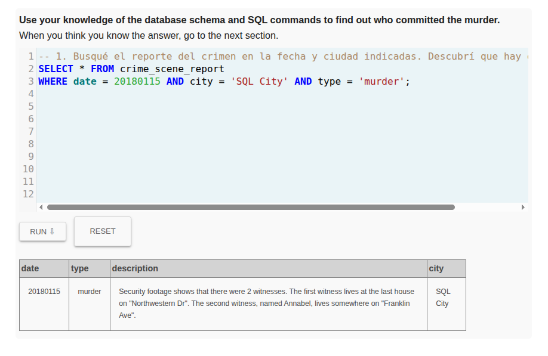
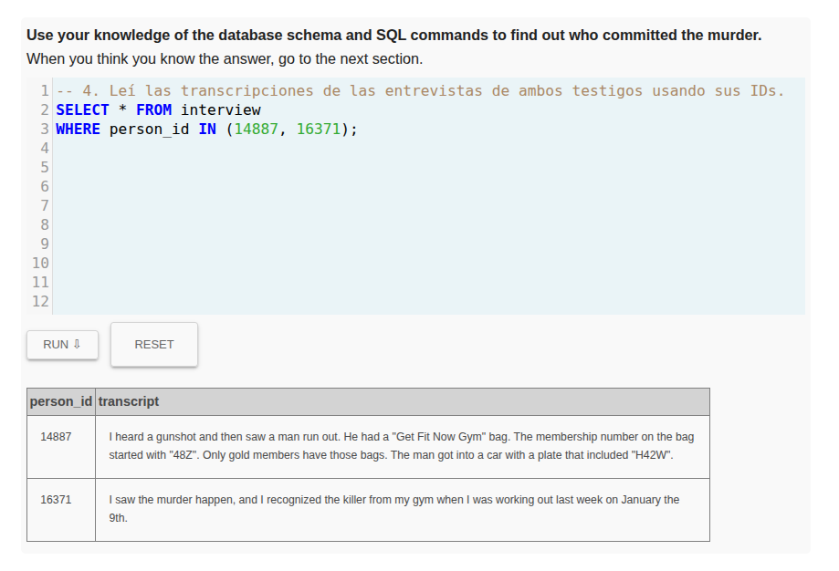
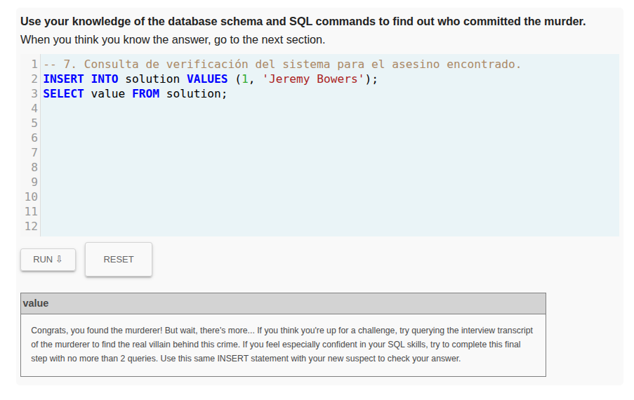

# SQL Murder Mystery - Alan Chala

## Resumen del Caso

Tras una exhaustiva investigación cruzando los registros policiales, entrevistas a testigos y bases de datos del gimnasio local, se determinó que el autor material del asesinato cometido el 15 de enero de 2018 en SQL City es **Jeremy Bowers**.

## Bitácora de Investigación

### 1. El reporte de la escena del crimen

Inicié buscando el reporte policial del día del asesinato en la ciudad indicada para entender qué había sucedido y encontrar los primeros indicios. La consulta arrojó que el primer testigo vive en la última casa de "Northwestern Dr" y el segundo testigo, llamada Annabel, vive en "Franklin Ave".

```sql
-- 1. Busqué el reporte del crimen en la fecha y ciudad indicadas. Descubrí que hay dos testigos.
SELECT * FROM crime_scene_report
WHERE date = 20180115 AND city = 'SQL City' AND type = 'murder';
```



### 2. Identificando a los testigos

Con los datos de las direcciones, procedí a buscar en la tabla de personas para encontrar el perfil exacto del primer testigo ordenando el número de casa de forma descendente. Logré identificarlo como Morty Schapiro.

```sql
-- 2. Busqué al primer testigo filtrando por la calle y ordenando por número de casa descendente para hallar la última.
SELECT * FROM person 
WHERE address_street_name = 'Northwestern Dr' 
ORDER BY address_number DESC 
LIMIT 1;
```

Luego, busqué a la segunda testigo. La identifiqué como Annabel Miller.

```sql
-- 3. Busqué a la segunda testigo 
SELECT * FROM person 
WHERE address_street_name = 'Franklin Ave';
```

### 3. Entrevistas de los testigos

Una vez obtenidos los identificadores de Morty y Annabel, busqué qué le dijeron a la policía el día del crimen. Morty declaró que el asesino tenía una bolsa del gimnasio "Get Fit Now" reservada para miembros "Gold", cuyo número empezaba por "48Z", y que huyó en un auto con placa que incluía "H42W". Annabel confirmó haber visto al asesino en el gimnasio el 9 de enero.

```sql
-- 4. Leí las transcripciones de las entrevistas de ambos testigos usando sus IDs.
SELECT * FROM interview 
WHERE person_id IN (14887, 16371);
```



### 4. Cruzando datos: Gimnasio y Vehículo

Con estas pistas tan específicas, busqué en la base de datos del gimnasio a los miembros que cumplieran con el estatus y el inicio del código de membresía. La búsqueda se redujo a dos sospechosos: Joe Germuska y Jeremy Bowers.

```sql
-- 5. Busqué a los miembros del gimnasio con membresía Gold y número iniciando en 48Z.
SELECT * FROM get_fit_now_member 
WHERE id LIKE '48Z%' AND membership_status = 'Gold';
```

Para desempatar, crucé la información de los sospechosos con las licencias de conducir usando el fragmento de placa que vio Morty. La placa de Jeremy Bowers coincidió exactamente con la descripción dada por el testigo, confirmando así que él es el asesino.

```sql
-- 6. Verifiqué las placas de los vehículos asociados a las licencias de los dos sospechosos.
SELECT person.name, drivers_license.plate_number 
FROM person 
JOIN drivers_license ON person.license_id = drivers_license.id 
WHERE person.id IN (28819, 67318);
```

### 5. Verificación del Culpable

Finalmente, utilicé la herramienta de la plataforma para validar mis hallazgos. El sistema arrojó el mensaje de felicitación confirmando que Jeremy Bowers es efectivamente el asesino material del caso.

```sql
-- 7. Consulta de verificación del sistema para el asesino encontrado.
INSERT INTO solution VALUES (1, 'Jeremy Bowers');
SELECT value FROM solution;
```

